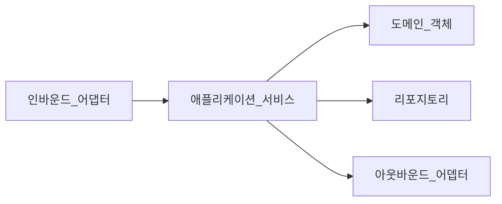
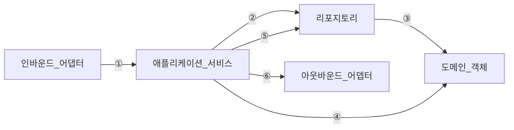

# 도메인 주도 설계

## 애플리케이션 아키텍처 패턴

- 트랜잭션 스트립트 : 서블릿, JSP, PHP
- 테이블 모듈 :
- 서비스 레이어
- 도메인 모델 패턴

### 트랜잭션 스크립트 패턴

클라이언트가 요청한 비즈니스 로직을 하나의 프로시저가 모두 처리

### 테이블 모듈 패턴

데이터베이스 테이블 단위로 비즈니스 로직을 처리하는 클래스를 분리

데이터베이스 테이블에 대응하는 클래스를 테이블 모듈로 선언하고 대상 테이블의 데이터를 조회하거나 변경

### 서비스 레이어 패턴

### 도메인 모델 패턴

데이터와 행위를 하나의 객체로 설계하는 패턴

비즈니스 로직이 복잡하고 객체지향 언어를 사용하면 도메인 모델 패턴을 우선적으로 고려
엔티티는 식별자를 가지는 반면 값 객체는 식별자를 가지지 않고 엔티티를 수식하는 속성의 그룹

## 핵사고날 아키텍처

비즈니싀와 기술의 분리를 강조

① 외부 요청을 애플리케이션 서비스로 요청 전달
② 리포지토리에 데이터를 조회
③ 데이터베이스 조회 결과를 도메인 객체로 변환
④ 도메인 객체에 요청을 전달해 비즈니스 로직을 수행
⑤ 데이터베이스에 결과 저장
⑥ 비즈니스 로직 수행 완료를 외부에 전달

## 도메인 주도 설계에서 서비스

- 인프라스트럭처 서비스
- 애플리케이션 서비스
- 도메인 서비스

### 인프라스트럭처 서비스

핵사고날 아키텍처에서 정의한 어뎁터

### 애플리케이션 서비스

트랜잭션 관리, 인프라스트럭처 서비스와 상호 작용을 포함한 비즈니스 유스케이스의 흐름을 조정하는 두 개의 책임을 가짐

1. 클라이언트 요청부터 응답까지 하나의 트랜잭션으로 처리

- 에러를 반환하거나 예외를 던지는 오류 처리
- 로깅, 매트릭, 모니터링 관련 기능

2. 비즈니스 유스케이스를 수행하는 일련의 흐름 조정

### 도메인 서비스

엔티티에 부여하기 적합하지 않은 책임을 도메인 서비스에 부여
기술에 의존성이 없는 POJO로 구현해야함

<!--
### 도메인 서비스

## 애그리게이트

## -->

애그리게이트는 도메인의 불변식을 유지하는 단위로 여러 개의 엔티티와 값 객체로 구성
도메인을 더 깊게 이해할수록 추상 클래스와 인터페이스를 활용해 도메인의 핵심을 표현할 수 있음
