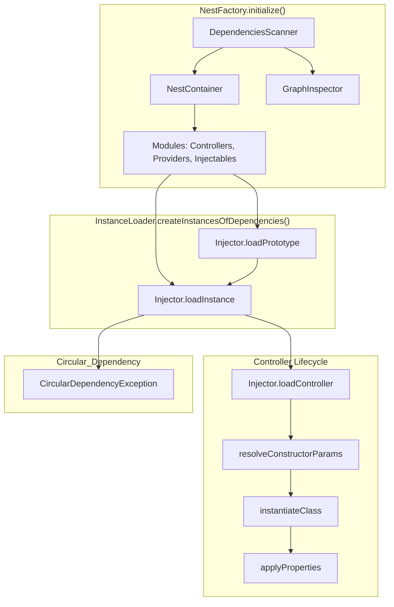

# Nestjs Deep Dive

https://docs.nestjs.com/modules


## 1. initialize 함수 (엔트리포인트)

Nest 앱을 부트스트랩하면서 의존성 그래프를 스캔하고, 인스턴스를 생성하는 메인 루틴

### 주요 컴포넌트:

- Injector: 인스턴스 생성기 (DI 책임)
- InstanceLoader: 프로토타입/인스턴스를 모듈 단위로 실제로 생성
- DependenciesScanner: 메타데이터 스캔 (@Module, @Injectable, @Controller 등 분석)

### 흐름:

dependenciesScanner.scan(module) → 모듈/컨트롤러/프로바이더 메타데이터를 스캔 후 컨테이너에 등록

instanceLoader.createInstancesOfDependencies() → 프로토타입 생성 후 실제 인스턴스 생성

dependenciesScanner.applyApplicationProviders() → 글로벌 프로바이더 등 애플리케이션 레벨 적용

https://github.com/cheonkyu/nest/blob/master/packages/core/nest-factory.ts#L201-L248

```ts
private async initialize(
    module: any,
    container: NestContainer,
    graphInspector: GraphInspector,
    config = new ApplicationConfig(),
    options: NestApplicationContextOptions = {},
    httpServer: HttpServer | null = null,
  ) {
    UuidFactory.mode = options.snapshot
      ? UuidFactoryMode.Deterministic
      : UuidFactoryMode.Random;

    const injector = new Injector({
      preview: options.preview!,
      instanceDecorator: options.instrument?.instanceDecorator,
    });
    const instanceLoader = new InstanceLoader(
      container,
      injector,
      graphInspector,
    );
    const metadataScanner = new MetadataScanner();
    const dependenciesScanner = new DependenciesScanner(
      container,
      metadataScanner,
      graphInspector,
      config,
    );
    container.setHttpAdapter(httpServer);

    const teardown = this.abortOnError === false ? rethrow : undefined;
    await httpServer?.init?.();
    try {
      this.logger.log(MESSAGES.APPLICATION_START);

      await ExceptionsZone.asyncRun(
        async () => {
          await dependenciesScanner.scan(module);
          await instanceLoader.createInstancesOfDependencies();
          dependenciesScanner.applyApplicationProviders();
        },
        teardown,
        this.autoFlushLogs,
      );
    } catch (e) {
      this.handleInitializationError(e);
    }
  }
```

## 2. Injector (주입기)

Nest의 DI 컨테이너 핵심.
역할:
loadPrototype: 프로토타입 객체 생성 후 collection(Map)에 저장
loadInstance: 의존성을 해석하고, 실제 클래스 인스턴스를 생성
즉,
loadPrototype → “틀”만 먼저 만든다 (클래스의 빈 객체)
loadInstance → “실제 인스턴스”를 만든다 (constructor 호출, DI 주입 등 처리)

https://github.com/cheonkyu/nest/blob/master/packages/core/injector/injector.ts#L229-L243

```ts
  public async loadController(
    wrapper: InstanceWrapper<Controller>,
    moduleRef: Module,
    contextId = STATIC_CONTEXT,
  ) {
    const controllers = moduleRef.controllers;
    await this.loadInstance<Controller>(
      wrapper,
      controllers,
      moduleRef,
      contextId,
      wrapper,
    );
    await this.loadEnhancersPerContext(wrapper, contextId, wrapper);
  }
```

https://github.com/cheonkyu/nest/blob/master/packages/core/injector/injector.ts#L109-L126

```ts
public loadPrototype<T>(
    { token }: InstanceWrapper<T>,
    collection: Map<InjectionToken, InstanceWrapper<T>>,
    contextId = STATIC_CONTEXT,
  ) {
    if (!collection) {
      return;
    }
    const target = collection.get(token)!;
    const instance = target.createPrototype(contextId);
    if (instance) {
      const wrapper = new InstanceWrapper({
        ...target,
        instance,
      });
      collection.set(token, wrapper);
    }
  }
```

https://github.com/cheonkyu/nest/blob/master/packages/core/injector/injector.ts#L128-L205

```ts
public async loadInstance<T>(
    wrapper: InstanceWrapper<T>,
    collection: Map<InjectionToken, InstanceWrapper>,
    moduleRef: Module,
    contextId = STATIC_CONTEXT,
    inquirer?: InstanceWrapper,
  ) {
    const inquirerId = this.getInquirerId(inquirer);
    const instanceHost = wrapper.getInstanceByContextId(
      this.getContextId(contextId, wrapper),
      inquirerId,
    );

    if (instanceHost.isPending) {
      const settlementSignal = wrapper.settlementSignal;
      if (inquirer && settlementSignal?.isCycle(inquirer.id)) {
        throw new CircularDependencyException(`"${wrapper.name}"`);
      }

      return instanceHost.donePromise!.then((err?: unknown) => {
        if (err) {
          throw err;
        }
      });
    }

    const settlementSignal = this.applySettlementSignal(instanceHost, wrapper);
    const token = wrapper.token || wrapper.name;

    const { inject } = wrapper;
    const targetWrapper = collection.get(token);
    if (isUndefined(targetWrapper)) {
      throw new RuntimeException();
    }
    if (instanceHost.isResolved) {
      return settlementSignal.complete();
    }
    try {
      const t0 = this.getNowTimestamp();
      const callback = async (instances: unknown[]) => {
        const properties = await this.resolveProperties(
          wrapper,
          moduleRef,
          inject as InjectionToken[],
          contextId,
          wrapper,
          inquirer,
        );
        const instance = await this.instantiateClass(
          instances,
          wrapper,
          targetWrapper,
          contextId,
          inquirer,
        );
        this.applyProperties(instance, properties);
        wrapper.initTime = this.getNowTimestamp() - t0;
        settlementSignal.complete();
      };
      await this.resolveConstructorParams<T>(
        wrapper,
        moduleRef,
        inject as InjectionToken[],
        callback,
        contextId,
        wrapper,
        inquirer,
      );
    } catch (err) {
      wrapper.removeInstanceByContextId(
        this.getContextId(contextId, wrapper),
        inquirerId,
      );

      settlementSignal.error(err);
      throw err;
    }
  }

```

## 3. InstanceLoader (인스턴스 로더)

Injector를 이용해 모듈 단위로 컨트롤러, 프로바이더, 인젝터블을 실제 인스턴스로 변환
단계:
createPrototypes() → 미리 모든 Provider/Controller의 프로토타입 생성
createInstances() → 실제 인스턴스 생성 (constructor 호출 + DI 적용)

https://github.com/cheonkyu/nest/blob/master/packages/core/injector/instance-loader.ts#L25-L38

```ts
  public async createInstancesOfDependencies(
    modules: Map<string, Module> = this.container.getModules(),
  ) {
    this.createPrototypes(modules);

    try {
      await this.createInstances(modules);
    } catch (err) {
      this.graphInspector.inspectModules(modules);
      this.graphInspector.registerPartial(err);
      throw err;
    }
    this.graphInspector.inspectModules(modules);
  }

```

https://github.com/cheonkyu/nest/blob/master/packages/core/injector/instance-loader.ts#L40-L46

https://github.com/cheonkyu/nest/blob/master/packages/core/injector/instance-loader.ts#L80-L85

```ts
 private createPrototypes(modules: Map<string, Module>) {
    modules.forEach(moduleRef => {
      this.createPrototypesOfProviders(moduleRef);
      this.createPrototypesOfInjectables(moduleRef);
      this.createPrototypesOfControllers(moduleRef);
    });
  }

   private createPrototypesOfControllers(moduleRef: Module) {
    const { controllers } = moduleRef;
    controllers.forEach(wrapper =>
      this.injector.loadPrototype<Controller>(wrapper, controllers),
    );
  }
```

https://github.com/cheonkyu/nest/blob/master/packages/core/injector/instance-loader.ts#L25-L38

https://github.com/cheonkyu/nest/blob/master/packages/core/injector/instance-loader.ts#L87-L96

```ts
  private async createInstances(modules: Map<string, Module>) {
    await Promise.all(
      [...modules.values()].map(async moduleRef => {
        await this.createInstancesOfProviders(moduleRef);
        await this.createInstancesOfInjectables(moduleRef);
        await this.createInstancesOfControllers(moduleRef);

        const { name } = moduleRef;
        this.isModuleWhitelisted(name) &&
          this.logger.log(MODULE_INIT_MESSAGE`${name}`);
      }),
    );
  }

  private async createInstancesOfControllers(moduleRef: Module) {
    const { controllers } = moduleRef;
    const wrappers = [...controllers.values()];
    await Promise.all(
      wrappers.map(async item => {
        await this.injector.loadController(item, moduleRef);
        this.graphInspector.inspectInstanceWrapper(item, moduleRef);
      }),
    );
  }
```

## 4. Prototype vs Instance

NestJS는 두 단계로 객체를 생성:
Prototype 단계 (loadPrototype):
실제 인스턴스는 아니고, “class의 껍데기” 같은 placeholder
이후 순환 참조(circular dependency) 감지에 활용
Instance 단계 (loadInstance):
constructor 호출 + DI 주입 → 실제로 사용할 인스턴스 생성
Property 기반 주입도 여기서 처리됨

## 5. Controller 생성 과정 예시

createPrototypesOfControllers → injector.loadPrototype 호출
createInstancesOfControllers → injector.loadController 호출
내부적으로 loadInstance 실행
resolveConstructorParams → 생성자 의존성 주입
instantiateClass → 실제 인스턴스 생성
applyProperties → 프로퍼티 주입 (@Inject 등)
즉, Nest가 컨트롤러를 사용할 수 있는 실제 인스턴스로 만들어주기 위해 두 단계를 거침.


