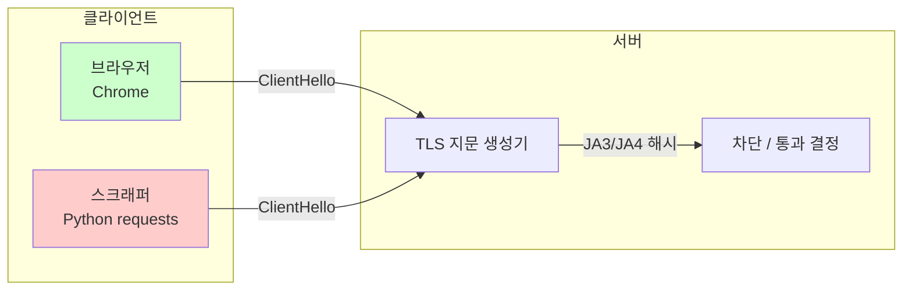
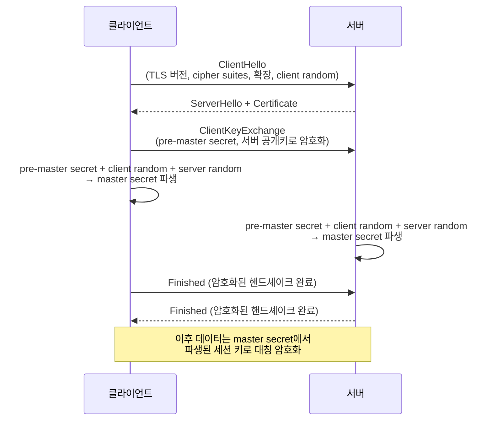

# TLS 지문 인식(TLS Fingerprinting) — 봇 탐지와 우회의 기술

웹 스크래핑이나 봇 방어를 다루다 보면 **TLS 지문(TLS fingerprint)**이라는 용어를 자주 만납니다. IP를 숨기고 User-Agent만 바꿨는데도 차단당하는 이유는, 서버가 HTTP 이전 단계인 **TLS 핸드셰이크**에서 클라이언트를 식별하기 때문입니다.

이 글에서는 TLS 지문이 어떻게 생성되고, 핸드셰이크의 키 교환(pre-master secret)과 무슨 관계가 있는지, 그리고 JA3/JA4 같은 대표적인 지문 규격과 우회 방법까지 정리합니다.

---

## 1. 핵심 요약: TLS 지문은 "연결의 DNA"



| 항목 | 설명 |
| --- | --- |
| **대상** | TLS `ClientHello` 메시지 (암호화되기 전, 평문) |
| **활용 값** | TLS 버전, 암호 모음 목록, 확장 목록/순서, 타원곡선 등 |
| **대표 규격** | JA3, JA4, JA4+ |
| **목적** | 브라우저 vs 봇, 정상 트래픽 vs 비정상 트래픽 식별 |
| **우회 수단** | curl-impersonate, uTLS, curl_cffi 등으로 브라우저 지문 재현 |

HTTP 헤더는 쉽게 위조할 수 있지만, TLS 핸드셰이크는 클라이언트가 사용하는 **TLS 라이브러리 자체의 특성**을 드러냅니다. 이 때문에 TLS 지문은 봇 탐지의 핵심 단서가 됩니다.

---

## 2. TLS 핸드셰이크와 키 교환

HTTPS 연결은 애플리케이션 데이터를 주고받기 전에 **TLS 핸드셰이크**를 먼저 수행합니다. 이 과정에서 클라이언트와 서버는 서로를 인증하고, 이후 통신에 사용할 대칭 키를 공유합니다.

### 2.1 핸드셰이크 전체 흐름



### 2.2 pre-master secret, master secret, session key

TLS 1.2 RSA 키 교환을 기준으로 각 용어를 구분하면 다음과 같습니다.

| 용어 | 설명 | 생성 위치 |
| --- | --- | --- |
| **pre-master secret** | 클라이언트가 생성한 무작위 값. 서버의 공개 키로 암호화되어 전송됨 | 클라이언트 |
| **master secret** | pre-master secret + client random + server random을 PRF로 혼합한 값 | 양측 |
| **session keys** | master secret에서 파생된 대칭 암호화/무결성 키 | 양측 |
| **public/private key** | 서버 인증서에 포함된 비대칭 키 쌍. pre-master secret 암호화/복호화에 사용 | 서버 |

```
pre-master secret
    + client random
    + server random
    → PRF(의사난수 함수)
    → master secret

master secret
    → key expansion
    → client write key / server write key / MAC key ...
```

TLS 1.3에서는 RSA 키 교환이 사라지고, 대부분 **ephemeral Diffie-Hellman** 방식을 사용합니다. 이 경우 pre-master secret 대신 양측이 각자 생성한 DH 공개 값을 교환하고, 비밀 키로부터 **shared secret**을 계산합니다. 용어는 달라도 핵심은 같습니다: 핸드셰이크를 통해 양측만 아는 공유 비밀을 만들고, 이로부터 세션 키를 파생합니다.

### 2.3 TLS 지문은 언제 생성되는가?

핸드셰이크의 첫 메시지인 `ClientHello`가 **암호화되지 않은 평문**으로 전송됩니다. 서버는 이 메시지를 해독할 필요 없이, 단순히 클라이언트가 제시한 매개변수를 관찰하여 지문을 만들 수 있습니다. 이것이 TLS 지문이 **비침습적이고 빠른** 이유입니다.

---

## 3. ClientHello에서 지문 추출하기

### 3.1 ClientHello에 포함된 핵심 필드

```
ClientHello
├── Legacy Version: 0x0303 (TLS 1.2를 의미하는 관례적 값)
├── Client Random: 32바이트 무작위 값
├── Session ID
├── Cipher Suites: [0x1301, 0x1302, 0x1303, ...]
├── Compression Methods: [null]
└── Extensions
    ├── server_name (SNI)
    ├── supported_versions
    ├── supported_groups
    ├── signature_algorithms
    ├── key_share
    ├── application_layer_protocol_negotiation (ALPN)
    └── ...
```

브라우저마다, 심지어 동일한 브라우저의 버전마다 이 필드들의 조합과 순서가 조금씩 다릅니다.

| 클라이언트 | 사용 TLS 라이브러리 | 특징 |
| --- | --- | --- |
| Chrome | BoringSSL | 확장 순서, GREASE 값, ALPN 등 고유 패턴 |
| Firefox | NSS | Chrome과 다른 cipher 우선순위 |
| Safari | Secure Transport | Apple 특화 구현 |
| Python requests | OpenSSL / urllib3 | HTTP/1.1 위주, 브라우저와 다른 확장 집합 |
| curl | OpenSSL | 기본값이 브라우저와 다름 |

### 3.2 TLS 지문의 실제 활용

서버는 지문을 통해 다음을 판단합니다.

- **브라우저 일관성**: User-Agent가 Chrome이라고 주장하지만, TLS 지문이 Chrome과 다르면 의심.
- **봇/스크래퍼 분류**: Python, curl, 비정상 TLS 라이브러리의 지문을 블랙리스트.
- **프록시 익명성 평가**: 프록시 트래픽이 실제 사용자 트래픽과 TLS 지문이 다르면 탐지.

---

## 4. JA3와 JA4

TLS 지문을 실제 시스템에서 쓰려면 표준화된 해시 방식이 필요합니다. 가장 널리 쓰이는 것이 **JA3**와 **JA4**입니다.

### 4.1 JA3 (2017)

Salesforce 엔지니어들이 제안한 방법으로, `ClientHello`에서 5개 필드를 추출해 MD5 해시를 만듭니다.

```
JA3 = MD5(
    SSLVersion,
    Cipher,
    SSLExtension,
    EllipticCurve,
    EllipticCurvePointFormat
)
```

예시 원본 문자열:

```
769,47-53-5-10-49161-49162-49171-49172-50-56-19-4,0-10-11,23-24-25,0
```

MD5 해시:

```
ada70206e40642a3e4461f35503241d5
```

**JA3의 한계**: Chrome 110, Firefox 114부터 브라우저가 TLS 확장 순서를 매 연결마다 무작위로 배치합니다. JA3은 확장 순서를 그대로 해시에 넣으므로, 동일한 Chrome이 매번 다른 JA3을 만들어냅니다. 결과적으로 JA3은 최신 브라우저 식별에 점점 무용지물이 되었습니다.

### 4.2 JA4 (2023)

FoxIO에서 제안한 차세대 규격입니다. 확장 순서를 **정렬(sorted)**한 뒤 해시하므로, 순서가 뒤섞여도 동일한 지문이 나옵니다.

형식:

```
a_b_c
```

예시:

```
t13d1516h2_8daaf6152771_e5627efa2ab1
```

| 세그먼트 | 의미 |
| --- | --- |
| **a** | `t`(TLS) + `13`(TLS 1.3) + `d`(SNI 있음) + `15`(cipher 15개) + `16`(extension 16개) + `h2`(ALPN=h2) |
| **b** | 정렬된 cipher 목록의 SHA-256 앞 12자리 |
| **c** | 정렬된 extension 목록 + signature algorithm의 SHA-256 앞 12자리 |

### 4.3 JA3 vs JA4

| 항목 | JA3 | JA4 |
| --- | --- | --- |
| 해시 | MD5 | SHA-256 truncated |
| 확장 순서 | 그대로 반영 | 정렬 후 해시 |
| cipher 순서 | 그대로 반영 | 정렬 후 해시 |
| ALPN/SNI | 미반영 | 사람이 읽을 수 있는 prefix에 포함 |
| 프로토콜 | TLS/TCP 위주 | TLS, QUIC, DTLS 지원 |
| 현재 상태 | 레거시 | Cloudflare, Akamai, AWS WAF 등에서 채택 |

JA4는 단독으로 쓰이기보다 **JA4+** 패밀리(JA4S, JA4H, JA4T, JA4X, JA4SSH 등)와 함께 사용되어 HTTP/2, TCP, 인증서, SSH까지 통합적으로 분석합니다.

---

## 5. 지문을 위조하고 우회하는 방법

봇 방지 시스템이 TLS 지문으로 판단한다면, 스크래퍼는 브라우저와 동일한 지문을 재현하면 됩니다.

### 5.1 curl-impersonate / curl_cffi

`curl-impersonate`는 libcurl을 패치하여 Chrome, Firefox, Safari의 TLS/HTTP2/HTTP3 지문을 그대로 흉내 내는 라이브러리입니다. Python에서는 `curl_cffi`로 감싸 사용합니다.

```python
from curl_cffi import requests

r = requests.get(
    "https://tls.browserleaks.com/json",
    impersonate="chrome124"
)
```

`impersonate` 옵션 하나로 다음이 한꺼번에 설정됩니다.

- TLS cipher 목록 및 확장 순서 (JA3/JA4 지문)
- HTTP/2 SETTINGS, WINDOW_UPDATE, pseudo-header 순서 (Akamai 지문)
- HTTP/3 지원 여부
- 기본 User-Agent, 헤더 순서

### 5.2 uTLS (Go) / CycleTLS (Node)

Go의 `crypto/tls`는 JA3 문자열을 그대로 주입할 수 있는 `uTLS` 패키지를 제공합니다. 마찬가지로 Node 진영에서는 `CycleTLS`가 JA3 문자열 기반 지문 조작을 지원합니다.

### 5.3 한계와 주의점

TLS 지문만 맞춘다고 무조건 통과하는 것은 아닙니다. 실제 봇 방지 시스템은 다음을 종합적으로 봅니다.

- TLS 지문 (JA4)
- HTTP/2 프레임 행동 (Akamai fingerprint)
- HTTP 요청 헤더 순서 및 쿠키 (JA4H)
- TCP/IP 스택 특성 (JA4T)
- 요청 빈도, 분포, 지리적 패턴, 행동 분석

따라서 TLS 지문은 **익명성의 필요조건**이지 **충분조건**은 아닙니다.

---

## 6. 마무리

TLS 지문 인식은 HTTPS 연결의 가장 초기 단계인 `ClientHello`를 관찰하여 클라이언트를 식별하는 기술입니다. IP 주소나 User-Agent는 쉽게 바꿀 수 있지만, TLS 라이브러리의 구현 특성은 그렇지 않습니다. 이 때문에 봇 방지와 프록시 익명성 양쪽에서 핵심적인 신호로 활용됩니다.

- **봇 방지 관점**: JA4를 비롯한 지문은 비침습적이고 빠르게 비정상 트래픽을 분류할 수 있습니다.
- **스크래핑/프록시 관점**: `curl_cffi` 같은 도구로 브라우저 지문을 모방하면 탐지율을 크게 낮출 수 있습니다.

하지만 TLS 지문은 결국 "어떤 클라이언트 소프트웨를 쓰는가"를 알려줄 뿐, 그 뒤의 행동까지 보장하지는 않습니다. 지문 위조와 행동 분석의 대립은 앞으로도 계속될 것입니다.

---

## Reference

1. [Bright Data — TLS 지문 인식이란 무엇인가요?](https://brightdata.co.kr/blog/web-data/tls-fingerprinting)
2. [Baeldung — Pre-master Secret vs. Master Secret vs. Private Key vs. Shared Secret](https://www.baeldung.com/cs/pre-master-shared-secret-private-public-key)
